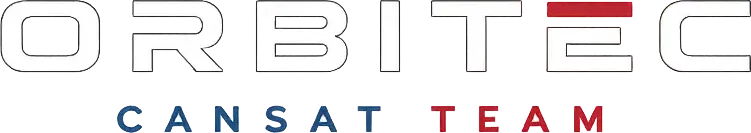

  

&nbsp;&nbsp;&nbsp;

<h1>🚀 NightRaptor · CanSat 2026</h1>

<strong>Explorar. Innovar. Inspirar.</strong>

Una misión estudiantil para observar el entorno, seguir el vuelo y explorar la detección temprana de incendios forestales.

<a href="#-la-misión">La misión</a> · <a href="#-el-cansat-físico">El CanSat real</a> · <a href="#-estación-de-tierra-y-dashboard">Dashboard</a> · <a href="#-inicio-rápido">Inicio rápido</a>

 

 

---

## 🌎 ¿Quiénes somos?

**ORBITEC** es un equipo multidisciplinario del **Instituto Tecnológico Superior de Uruapan (ITSU)** que desarrolla tecnología espacial mediante la plataforma CanSat. Reunimos electrónica, programación y diseño mecánico para aprender haciendo y crear proyectos con impacto positivo.

## 🌲 La misión

**NightRaptor** es nuestro CanSat 2026. Durante el descenso, su objetivo es recopilar datos ambientales y de vuelo para investigar señales que puedan ayudar a la **detección temprana de incendios forestales**. El dashboard presenta las lecturas y una alerta de posible riesgo basada en gas/VOC; una alerta requiere confirmación con el resto de los sensores y la ubicación.

| Subsistema | Función en la misión |
| :-- | :-- |
| **BME688** | Temperatura, presión, humedad y lectura de gas/VOC. |
| **BNO085** | Movimiento y orientación mediante acelerómetro, giroscopio y magnetómetro. |
| **GPS NEO-6M** | Coordenadas para ubicar y recuperar el CanSat. |
| **LoRa** | Enlace de telemetría con la estación de tierra. |
| **Arduino Nano ESP32** | Control del sistema y adquisición de datos. |
| **Paracaídas y estructura impresa en 3D** | Descenso controlado y protección de la electrónica. |

La página de especificaciones presenta como referencia un cuerpo de **115 mm de altura**, **66 mm de diámetro**, **300 g** y batería de **3.7 V**. Estas cifras describen el diseño mostrado en la web y pueden cambiar durante la integración física.

## 📸 El CanSat físico

Estas son las **tres fotografías reales** incorporadas al proyecto. Muestran la evolución del prototipo que se conecta con la estación de tierra para enviar información al dashboard.

  
  
  

| Vista | Qué se aprecia |
| :-- | :-- |
| [Carcasa de colmena](public/cansat_fisico/Impresion%203D%20Colmena.jpg) | Estructura exterior impresa en 3D. |
| [Electrónica apilada](public/cansat_fisico/vista%20de%20pcbs.jpg) | Placas circulares, cableado y módulos del prototipo. |
| [CanSat y estación de tierra](public/cansat_fisico/vista%20pcbs%20con%20estacion%20de%20carga%20util%20y%20estacion%20de%20tierra.jpg) | Conjunto físico y equipo receptor. |

## 🛰 Estación de tierra y dashboard

El repositorio incluye una web informativa en `/`, una pantalla de acceso en `/login` y el panel de misión en `/dashboard`. La pantalla de acceso lleva al panel, pero **todavía no implementa autenticación real**.

    CanSat → enlace LoRa → receptor de la estación de tierra
           → USB / puerto serie → navegador (Web Serial) → dashboard
                                                  └── historial y exportación CSV

En la vista **Conexión LoRa**, el operador selecciona el puerto USB y la velocidad que corresponda al receptor; la opción inicial es **9600 bps**. Cuando llegan tramas válidas, el panel actualiza las vistas de telemetría, gráficas, mapa y modelo 3D. También permite **simular una transmisión** para recorrer la interfaz sin hardware. El navegador guarda un respaldo local de las tramas y permite descargar un CSV o elegir un archivo para registro automático cuando la API de archivos está disponible.

> **Para usar el receptor físico:** abre el dashboard en un contexto seguro (HTTPS o `localhost`) con un navegador compatible con Web Serial, como Chrome o Edge, conecta el receptor USB y concede acceso al puerto. La recepción en vivo depende de que el hardware envíe tramas con el formato esperado; abrir el panel por sí solo no establece una conexión.

El lector acepta tramas CSV de **21 campos** con identificador de equipo, tiempo de misión, contador, altitud, temperatura, voltaje, aceleración, estado de vuelo, coordenadas, presión, humedad, gas/VOC, giroscopio y magnetómetro. También admite una variante extendida de 26 campos. Los estados de vuelo admitidos son `WAIT`, `DESC` y `LAND`.

### Lo que puedes explorar

- **Resumen y telemetría:** altitud, velocidad vertical, batería, movimiento, variables ambientales y estado de vuelo.
- **Conexión:** selección de puerto, velocidad, consola de tramas y modo de simulación.
- **Mapa:** posición GPS, recorrido y preparación de una zona para consulta sin conexión.
- **Gráficas:** evolución de las lecturas recibidas durante la misión.
- **Modelo 3D:** visualización de la actitud del CanSat con Three.js.
- **Registro:** historial local y exportación de telemetría a CSV.

Algunos indicadores de la interfaz usan valores iniciales o demostrativos hasta que se reciben datos compatibles. La alerta de incendios es una señal de apoyo para investigación, no una confirmación automática de un incendio.

## ✨ El sitio web

La página principal presenta al equipo, la misión NightRaptor, el diseño del CanSat, sus especificaciones, las PCBs, el microcontrolador, los sensores, la telemetría, la recuperación con paracaídas y los integrantes. Utiliza vídeo, animaciones y recursos espaciales locales, incluido el [astronauta](public/astronauta.webp) de la pantalla de acceso.

## 🧰 Tecnologías del repositorio

| Área | Tecnologías verificadas en el proyecto |
| :-- | :-- |
| Sitio | Astro 7, React 19, TypeScript y Tailwind CSS 4. |
| Animación e interfaz | GSAP, Framer Motion y Lucide React. |
| Datos y visualización | Recharts, MapLibre GL, React Three Fiber, Drei y Three.js. |
| Conexión local | Web Serial, almacenamiento del navegador y exportación CSV. |
| Hardware presentado | Arduino Nano ESP32, BME688, BNO085, GPS NEO-6M y radio LoRa. |

## 🚀 Inicio rápido

**Requisito:** Node.js 22.12 o superior.

    npm install
    npm run dev -- --background

Abre la dirección local que muestre Astro y visita `/`, `/login` o `/dashboard`. Para gestionar el servidor iniciado en segundo plano:

    npx astro dev status
    npx astro dev logs
    npx astro dev stop

Para generar y revisar la versión de producción:

    npm run build
    npm run preview

## 🗂 Organización

    public/                  Logos, astronauta, vídeos, imágenes y fotos del CanSat
      cansat_fisico/         Tres fotografías del prototipo
    src/pages/               Página principal, acceso y dashboard
    src/components/          Secciones de la web
      dashboard/             Vistas, widgets y recepción de telemetría
    src/styles/              Estilos globales

## 👨‍🚀 Equipo y enlaces

La sección del equipo en la web presenta a **Eduardo** (software), **Jaime** y **Ariadna** (estructuras), y **David** y **Aldo** (electrónica).

[GitHub de ORBITEC](https://github.com/OrbitecUruapan) · [LinkedIn](https://www.linkedin.com/company/orbitec-uruapan/) · [Instagram del Tecnológico de Uruapan](https://www.instagram.com/tecnmcampusuruapan/)

## 📄 Licencia

Este repositorio aún no incluye un archivo `LICENSE`. Para reutilizar código, imágenes o elementos de identidad visual fuera de este proyecto, consulta primero con el equipo ORBITEC.

---

  
  
<strong>ORBITEC · Instituto Tecnológico Superior de Uruapan</strong> De Uruapan hacia nuevas fronteras. 🚀

